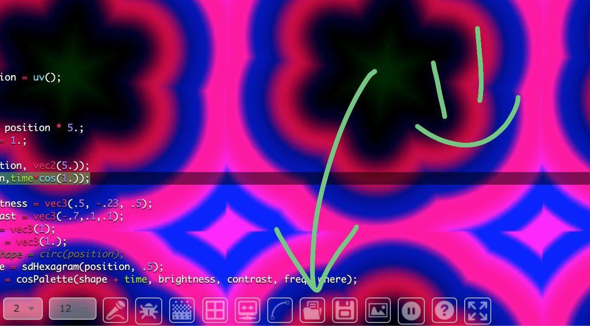

#  Shaders Workshop with Char Stiles

These .frag files were created by ART+TECH instigators in the CODAME Shaders Workshop with Char Stiles, as part of the `Code Art Together` series of e-vents. 

http://codame.com/events/workshop-shaders

# Viewing these files

To view the shaders, open the .frag and paste it's contents in https://shawnlawson.github.io/The_Force/. Play more, update, remix, and share what you come up with! Tag #Codame @Codame @CharStiles

You can also open .frag files directly in [The_Force](https://shawnlawson.github.io/The_Force/) if you find the right icon 

# Generating GIFs from .frag files

* Toggle The_Force text editor off with CTRL+SHIFT.
* Try enabling audio input, some of the .frags are audio reactive!
* Make a screen recording (tested: Quicktime on Mac, [ShareX](https://getsharex.com/) on Win, [OBS](https://obsproject.com/) is cross platform but takes some setup).
* Upload your screen recording to [ezgif](https://ezgif.com/video-to-gif). 
* Play with the length of the gif and frame rate until you capture the essence of the animation. Generally, the less frames and the shorter time the better, since in the end you want a gif <1mb in size. 
* If you wind up with a larger file, time to optimize the gif! It depends on the content, but ezgif has options to reduce the number of colors, the dimensions of the gif, or the compression applied to the gif. Experiment until you're happy 🤓

